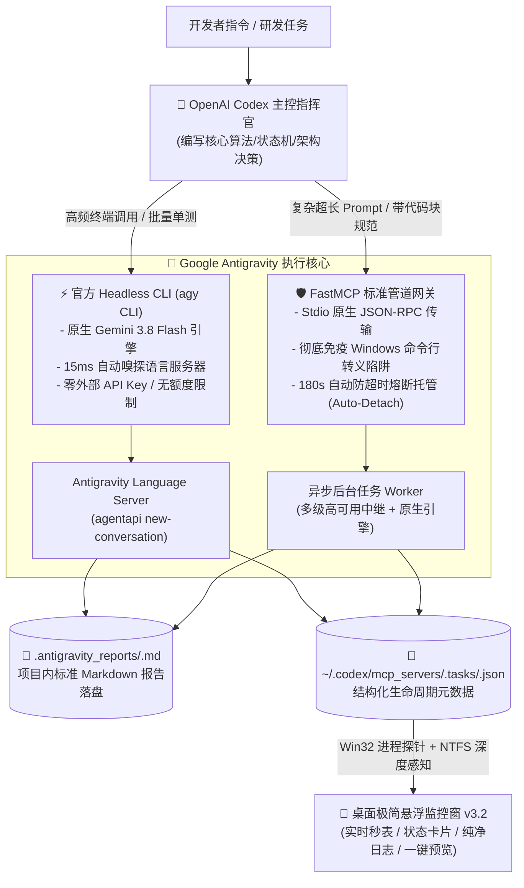

# 🚀 Codex Antigravity Bridge

<p align="center">
  
  
  
  
  
  
  
</p>

> **让 OpenAI Codex 零感知、无缝调度 Google Antigravity 高级多智能体进行重型代码落地与批量单测编写。内置“全自动防超时自愈引擎”与 Stdio 原生管道，彻底终结客户端 300 秒网关超时与命令行引号转义陷阱，配备 Win32 进程级深度感知与桌面极简悬浮监控窗。**

---

## 💡 为什么需要本工具？解决的核心痛点

在用 OpenAI Codex / Claude / Cursor 协同研发大型项目时，开发者往往面临以下核心挑战：

1. **💸 Codex 上下文与 Token 极其昂贵**：
   - 编写数十个样板单测用例、机械性跨文件重构、数据清洗等“搬砖脏活”如果全由 Codex 亲历亲为，会迅速耗尽上下文窗口与配额。
2. **💥 300 秒硬性超时拦截（`timed out awaiting tools/call after 300s`）**：
   - 当 Antigravity 在背后深入分析多文件或跑全套测试套件时，耗时常达 5~20 分钟；Codex 客户端对单次 MCP 工具调用设有限制，一旦超时直接报错断开，前功尽弃。
3. **🪟 Windows 命令行转义陷阱（引号剥离 / 8192 字符上限）**：
   - 在 PowerShell/CMD 中使用批处理命令行传参时，带有中文标点、双引号嵌套、反引号代码块、括号或管道符 `|` `&` 的超长 Prompt 极易被系统 Shell 截断破坏或触发语法错误。
4. **👻 后台长任务黑盒无感与“僵尸任务悬挂”**：
   - 缺少可视化状态同步；在 Windows NTFS 文件系统下，原地改写任务文件不会更新目录时间戳，旧监控容易导致计时器持续走字（如秒表卡在 98 分钟假死）。
5. **🌐 本地代理（Clash Verge）重启与上游网络瞬断**：
   - 梯子自动重载节点时本地 7890 端口瞬断 1~2 秒，直接引发 HTTP 502/503/504 导致长时间多轮推理崩溃。

---

## 🏛️ 双通道执行管线架构 (Dual-Channel Architecture)

本桥接系统提供 **CLI** 与 **MCP** 双通道协同管线，主控 Codex 可根据任务形态自由委派：



### 通道一：官方 Headless CLI (`agy CLI`)
- **零 Key、零额度限制**：基于官方 Antigravity Headless 接口（`language_server.exe agentapi new-conversation --model=flash`），依托本地官方账号会话，由 **Gemini 3.8 Flash 原生驱动**，完全不消耗第三方 API 费用。
- **15ms 极速环境嗅探**：内置 `discover_antigravity_env()`，毫秒级探测运行中的 Antigravity 语言服务器端口与 CSRF Token，自动剥离外层 HTTP 代理，确保本地 gRPC 握手直连。
- **转录流实时同步**：自动跟踪 `transcript.jsonl`，并将每一步工具调用（`view_file`、`replace_file_content`、`run_command`）动态投递至桌面悬浮窗。

### 通道二：FastMCP 标准服务网关 (`antigravity_execute` 等)
- **彻底告别 Shell 转义**：Stdio 管道原生 JSON-RPC 传输，对数千字的中文详细技术规范、JSON 样例、正则表达式与多层引号实现**100% 原始传输**，无视 Windows 8192 字符限制。
- **全自动防超时自愈体系 (Auto-Detaching Hybrid)**：
  - 常规小任务（<180s）：同步直接返回完整结果；
  - 超长重型任务（>180s 或审查 $\ge 3$ 文件）：**提前 120 秒在 180s 安全死线前平滑转入后台托管**，向 Codex 返回交接凭据，后台 Worker 绝不中断全力执行，**从物理上彻底杜绝 300 秒超时红线**。
  - 任务成果自动落盘至 `<workspace>/.antigravity_reports/<task_id>.md`。

---

## 🤝 角色协同与分层委派协议 (Core-First Subagent Policy)

为了最大化节约 Token 并保障代码质量，Codex 与 Antigravity 遵循严格的分工协议：

| 维度 | OpenAI Codex (主控操刀者) | Google Antigravity (外围搬砖者) |
|---|---|---|
| **核心定位** | **Master, Architect & Core Coder** | **Helper, Implementer & Worker** |
| **工作职责** | 核心业务模型、资产状态机、高风险逻辑亲自编写落盘；把关最终代码审查 | 外围代码填充、机械性重构、全局异常守卫与日志包裹、批量编写 `pytest` 测试用例 |
| **协同工作流** | **Step 1（核心先行）**：Codex 亲自动手写核心；<br>**Step 3（审查把关）**：运行测试亲自检验 | **Step 2（实质委派）**：接收 Codex 派发的外围任务与单测编写，直接修改文件落盘 |
| **🚫 绝对红线** | **严禁将 Antigravity 用作纯文本只读审查员**（严禁要求它做规范符合性挑刺长篇大论，代码规范由本地 pytest/linter 校验，彻底节约 Token） | **严禁 Codex 派生子智能体二次调用 Antigravity**（调用权限仅属于 Codex 主控会话，禁止层级递归转派） |

---

## 🎨 暗黑极简桌面悬浮监控窗 (Widget v3.2)

专为长任务状态跟踪量身定制的桌面小组件，具备工业级自愈防护：

- **Windows NTFS 目录时间戳自愈**：
  - 传统监控通过比对目录 `mtime` 判断是否有新任务，而在 Windows NTFS 底层，**原地更新已有 JSON 文件不会刷新父目录 mtime**！
  - Widget v3.2 采用 `os.scandir` 文件签名扫描与 `os.utime` 显式同步机制，彻底攻克状态不刷新的系统级顽疾。
- **Win32 毫秒级进程存活探测**：
  - 弃用传统的假阳性句柄判断，底层调用 Windows `kernel32.WaitForSingleObject` (`WAIT_TIMEOUT == 258`) 配合 `GetExitCodeProcess` (`STILL_ACTIVE == 259`)，进程一旦退出毫秒级感知，**彻底消灭秒表持续走字至 98 分钟的悬挂现象**。
- **BUSY 状态 2 秒主动自愈探针**：
  - 运行中即使遭遇宿主崩溃或强制关闭，监控窗每 2 秒主动探测一次 worker 活跃度，2 秒内自动自愈收敛为 `空闲待命`。
- **一键成果操作与暗黑 Markdown 预览**：
  - 卡片常驻 **[👁️ 预览] [📄 打开] [📂 目录]** 快捷按钮；
  - 内置极简高颜值 Markdown 预览弹窗，支持最大化、全域鼠标平滑滚轮与右下角 `⋰` 自由拉伸。
- **微型悬浮胶囊状态条 (32px)**：
  - 双击标题栏或右键最小化按钮，瞬间收缩为 32px 极简胶囊条（`🤖 [空闲待命] 耗时: 298.6s`）；支持五档透明度循环切换（`🌓 65% / 50% / 75% / 85% / 100%`）。
- **长任务 Windows 系统级气泡提醒**：
  - 任务耗时超过 60 秒完成时，自动触发 Windows 原生 Toast 气泡通知与提示音。

---

## 🛠️ 工具与技能矩阵 (Tool Matrix)

| 工具 / 接口 | 类型 | 核心能力 | 最佳适用场景 |
|---|---|---|---|
| **`agy -p`** | **全局命令行 (CLI)** | 官方 Headless 引擎直连，免 Key 无限并发，自动环境嗅探 | 批量生成单测、脚本跑测、终端自动化 |
| **`antigravity_execute`** | **MCP 核心代码工具** | 免疫 Windows 引号转义，直接读写文件、改写代码、运行测试落盘 | 复杂技术规范代码落地、多文件协同重构 |
| **`ask_antigravity`** | **MCP 智能工具** | 180s 内同步直出，超时平滑转后台报告并返回凭据 | 探索性提问、架构方案调研、技术选型 |
| **`antigravity_code_review`** | **MCP 审查工具** | $\ge 3$ 文件 0.1s 秒转后台，1~2 文件 180s 智能熔断 | 大批量代码合规性与安全性深度审计 |
| **`ask_antigravity_async`** | **MCP 显式异步** | 立即返回任务 ID，后台全速执行并生成持久化报告 | 明确需要 10 分钟以上的超大型分析任务 |
| **`antigravity_code_review_async`**| **MCP 显式异步** | 立即返回任务 ID，后台执行全库审查 | 架构级全库安全扫描 |
| **`check_antigravity_task`** | **MCP 状态查询** | 查询后台任务当前状态、耗时、执行摘要与报告路径 | 轮询跟踪长任务进展（支持 `wait_seconds`） |
| **`list_antigravity_tasks`** | **MCP 任务列表** | 返回最近 5 次后台任务的执行概览与状态矩阵 | 全局历史任务快速追溯 |
| **`call-agy`** | **Codex Skill** | 自动意图识别，引导主控 Codex 正确委派工作 | Codex 日常开发工作流全自动拦截接入 |

---

## 🚀 快速上手与部署

### 1. 一键全自动安装

克隆本仓库后，双击运行 **`install.bat`**，或在 PowerShell 中执行：

```powershell
.\install.ps1
```

脚本将全自动完成：
1. 检查 Python 3.10+ 环境与核心依赖（`mcp`, `google-antigravity`）；
2. 自动部署 `antigravity_mcp.py`、`antigravity_cli.py` 与 `antigravity_widget.py` 到 `~/.codex/mcp_servers/`；
3. 将全局命令 `agy.cmd` 部署至环境变量 PATH（`~/.gemini/antigravity/bin`）；
4. 自动在 `~/.codex/config.toml` 中注册 MCP 服务器；
5. 在桌面生成 **【启动Antigravity监控窗.bat】** 快捷方式。

### 2. 手动配置参考 (`~/.codex/config.toml`)

若需手动配置 MCP，只需在 `~/.codex/config.toml` 中加入：

```toml
[mcp_servers.antigravity]
command = "python"
args = ["-u", "C:/Users/Administrator/.codex/mcp_servers/antigravity_mcp.py"]
```

### 3. 启动桌面悬浮监控

双击桌面的 **【启动Antigravity监控窗.bat】**，悬浮窗将常驻桌面右上角，实时提供秒表走字、呼吸状态灯与最近任务预览。

---

## 💡 典型实战范例

### 范例 A：通过 CLI 快速委派批量单测编写（Codex 常用）

```bash
agy -p "参考 app/market/global_markets.py 的测试模式，为 app/market/industry_board.py 编写完整的单元测试覆盖，直接修改文件并运行 pytest，终端控制台汇报控制在 150 字以内。" --dangerously-skip-permissions --print-timeout 25m
```

### 范例 B：通过 MCP 执行复杂长 Prompt 代码落地（免转义）

在 Codex 中直接下达指令，Codex 会自动调用 `antigravity_execute`：

```text
请调用 antigravity_execute 实现行业板块横截面数据接入：
1. 新建 app/market/industry_board.py，解析东财 push2 接口；
2. 新建 tests/test_board_http.py，包含至少 25 项边界测试；
3. 保证严格 JSON 防护与有限数校验，跑通 pytest 后在工作区生成报告。
```

任务将自动在后台全速推进，并在项目目录生成标准报告：
`📄 <workspace>/.antigravity_reports/ex-20260917-xxxxxx.md`。

---

## 📂 项目结构

```text
codex-antigravity-bridge/
├── bin/
│   └── agy.cmd                      # 全局 agy CLI 入口脚本 (转发至 antigravity_cli.py)
├── launcher/
│   └── 启动Antigravity监控窗.bat      # 桌面一键无控制台静默启动器
├── mcp_servers/
│   ├── antigravity_cli.py           # 官方 Headless CLI 核心实现 (Gemini 3.8 Flash)
│   └── antigravity_mcp.py           # FastMCP 智能服务端 (防超时熔断 / 多级中继 / 报告落盘)
├── widget/
│   └── antigravity_widget.py        # 暗黑极简桌面悬浮监控窗 v3.2 (Win32探针 / NTFS自愈)
├── agents/
│   └── antigravity.toml             # Codex Subagent 智能体配置模板
├── skills/
│   └── call-agy/                    # 委派协议 Skill 定义
├── install.bat                      # Windows 一键安装批处理入口
├── install.ps1                      # 自动化安装与环境初始化脚本
├── AGENTS.md                        # 角色协同与分层委派协议规范
├── SKILL.md                         # Skill 快速说明文档
├── README.md                        # 项目完整说明文档
└── LICENSE                          # MIT 开源许可证
```

---

## 📄 License

本项目采用 [MIT License](LICENSE) 开源许可证。
欢迎提交 Issue 与 PR 共同完善！
