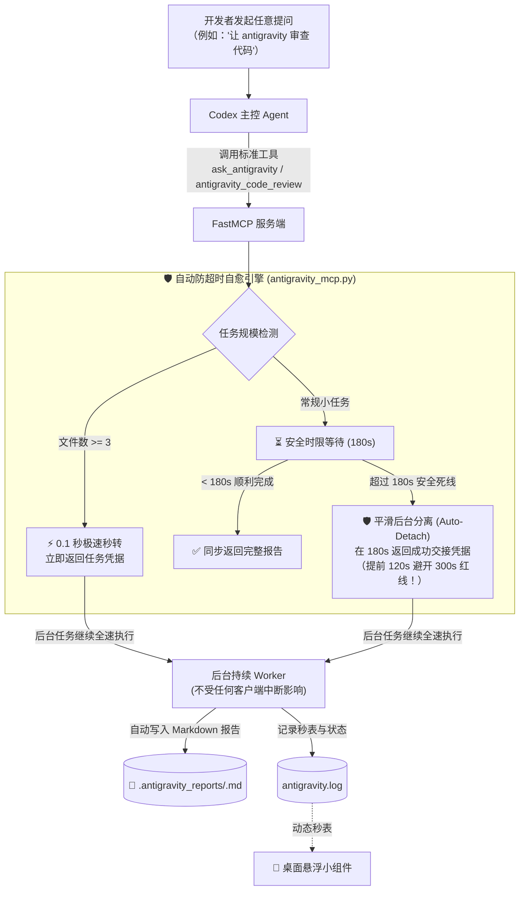

# 🚀 Codex Antigravity Bridge

<p align="center">
  
  
  
  
  
</p>

> **让 OpenAI Codex 零感知、无缝调度 Google Antigravity 高级多智能体进行深度代码探索与代码审查。内置“全自动防超时自愈引擎”，彻底终结客户端 300 秒（5分钟）网关超时中断，配备原生桌面悬浮监控小组件。**

---

## 💡 为什么需要本工具？解决的核心痛点

在用 OpenAI Codex / Claude / Cursor 协同研发大型项目时，开发者面临的最痛苦问题是：
1. **💥 300 秒硬性超时拦截（`timed out awaiting tools/call after 300s`）**：
   - 当 Antigravity 在背后深入审计 10+ 个文件或执行复杂重构时，往往需要 10~30+ 分钟。
   - Codex 客户端对任意单次 MCP 工具调用设有 300 秒硬性超时限制，一旦超时直接报错断开，用户往往等待了 5 分钟却一无所获！
2. **每次都要反复提醒 Agent“用异步”**：
   - 主控 Agent 经常遗忘提示词规则，惯性调用同步工具，导致开发者疲于奔命地在 prompt 里强调“请用异步模式”。
3. **调用过程黑盒无感**：
   - 委派后台运行长任务时，界面静止，无法感知子任务当前耗时与健康状态。
4. **代理切换/网络闪断导致 10 分钟长任务前功尽弃（HTTP 502/503/Unable to connect）**：
   - 本地科学上网客户端（Clash Verge / VPN）切换节点或自动重载时，本地代理端口（7890）会有 1~2 秒瞬断。在进行多轮推理时长任务直接崩溃。

---

## 🛡️ 核心黑科技：全自动防超时自愈体系 (Auto-Detaching Hybrid)

开发者**无需在对话中刻意强调“用异步”**，系统从底层彻底消除超时：



### 为什么 Codex 永远不会再报 300s 超时？
- **审查 $\ge 3$ 个文件**：0.1 秒内直接以后台托管模式返回确认。
- **其他任何任务**：最长等待 180 秒（比 Codex 的 300 秒极限早整整 2 分钟！）。一旦到达 180 秒，**系统自动平滑转入后台托管并向 Codex 返回成功状态**，后台任务绝不中断继续全力生成报告。
- 👉 **从物理上，Codex 单次调用耗时永远不会触及 300 秒！**

### 🌐 上游网络与代理闪断自愈引擎
- 针对 5~30 分钟的多轮长任务，内置 **指数退避重试（Exponential Backoff Retry）**。
- 自动识别并拦截 `502 Bad Gateway`、`503 Service Unavailable`、`504 Gateway Timeout`、`Unable to connect` 等由梯子重启、节点切换或网络抖动引起的瞬时断网。
- 重试时桌面悬浮窗实时呈现黄色自愈状态并持续计时，重试成功后任务无缝续跑，彻底告别单次网络闪断毁掉整个长任务。

### 🧠 五级递进智能自愈推理架构 (5-Tier Cascade Architecture)
系统内置高可靠自愈级联调度链路，全自动应对配额限制、区域封锁与网络波动：
1. **Tier 1 (前置尝鲜)：`gemini-3.8-flash`**：Google 原生最新预览模型。若触发日限（429）自动冷却 30 分钟；若触发区域限制（400: User location not supported）自动冷却 1 小时屏蔽 Google 原生并交由中继完全接管。
2. **Tier 2 (本地中继高可用集群 - 三级优先级)**：
   - **优先级一 (Relay M1)：`agentrouter/gpt-5.6-sol`**：旗舰推理模型，每天北京时间 **0:00、8:00、16:00 限量供应**。额度耗尽（`402 Budget pool quota has been exhausted`）后自动冷却至下一放量批次，平滑无缝流转至优先级二；
   - **优先级二 (Relay M2)：`agentrouter/deepseek-v4-flash`**：高并发快速编程主力，具备超强长任务耐受力与 `policy.allow_all()` 全局静默授权；
   - **优先级三 (Relay M3)：`agentrouter/glm-5.3`**：中继终极保底引擎，在 M1/M2 异常时无缝接管。
3. **Tier 3 (终极原生保底)：`gemini-2.5-flash`**：Google 官方 1500 次/天高配额主力基准模型，在中继不可用且网络环境支持时作为最后底牌。

### 🎨 暗黑极简桌面悬浮监控窗 (Widget v3)
- **极简常驻与五级流向**：屏幕常驻显示 `3.8 -> [Sol/DS/GLM] -> 2.5` 状态与动态走字秒表；
- **全域交互与自由拉伸**：580px 展开面板，搭载 Canvas 滚动容器与 6px 暗黑细滑块，支持滚轮全域滑动与右下角 `⋰` 自由拉伸；
- **全状态即时预览与排查**：无论任务处于“执行完成”、“后台运行中”、“异常失败”还是“孤儿中止”，均可一键弹出 Markdown 独立预览窗口查看详情、跟踪日志与完整调用栈。

---

## 🛠️ 工具与技能矩阵列表

| 工具/技能名 | 类型 | 核心能力 | 适用场景 |
|---|---|---|---|
| `call-agy` (Skill) | **Codex 技能** | 自动意图识别，引导 Codex 委派重型任务至 Antigravity | 复杂多文件调研、第二视角审计、大批量生成测试/文档 |
| `agy -p` (CLI) | **全局命令行** | 命令行直连五级自愈中继，支持 `--print-timeout` 与 `--add-dir` | 终端脚本批处理、CI 跑测、无 MCP 环境调用 |
| `ask_antigravity` | MCP 工具 | 180s 内直接返回；超过 180s 自动转后台并写入报告 | 单文件探索、疑难定位、架构设计 |
| `antigravity_code_review` | MCP 工具 | $\ge 3$ 文件 0.1s 秒转后台；1~2 文件超 180s 自动转后台 | 代码安全与规范审查、批量重构 |
| `ask_antigravity_async` | MCP 显式异步 | 立即返回任务 ID，后台自主运行 | 开发者/Codex 显式指定超长任务 |
| `antigravity_code_review_async` | MCP 显式异步 | 立即返回任务 ID，后台深度审计 | 开发者/Codex 显式指定超长审查 |
| `check_antigravity_task` | MCP 同步查询 | 支持 `wait_seconds` 可选等待，完成后返回报告摘要与路径 | 进度查询、耗时秒表检测 |
| `list_antigravity_tasks` | MCP 同步列表 | 返回最近后台任务矩阵与状态图标 | 全局历史任务追踪 |

---

## 🚀 快速上手

### 1. 一键自动安装

双击运行 **`install.bat`**，或在 PowerShell 中执行：

```powershell
.\install.ps1
```

### 2. 启动悬浮监控

双击桌面的 **【启动Antigravity监控窗.bat】**，悬浮小卡片常驻屏幕右上角，实时提供秒表走字与三色灯提示。

### 3. 日常自由使用

在 Codex 中直接下达指令，**无需关心后台细节，无需输入“异步”**：

```text
让 antigravity 审查 app/ 下面的 6 个核心数据模块，重点看内存占用和并发死锁风险。
```

Codex 将收到秒级托管凭据，任务在后台稳步运行，完成后报告自动落盘于项目目录下的 `.antigravity_reports/` 中！

---

## 📄 License

本项目采用 [MIT License](LICENSE) 开源。
