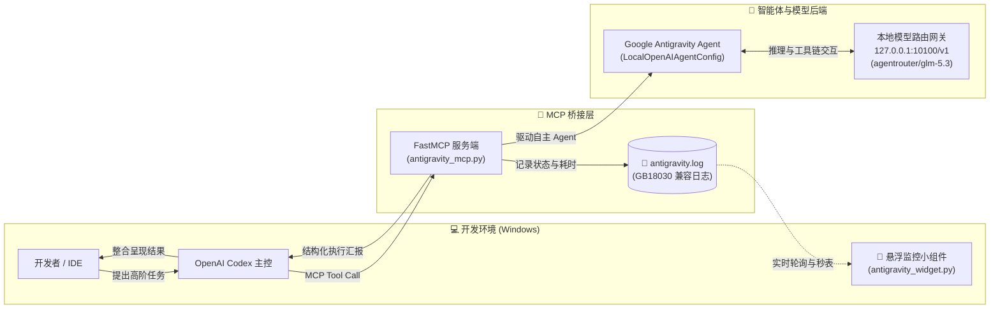

# 🚀 Codex Antigravity Bridge

<p align="center">
  
  
  
  
  
</p>

> **让 OpenAI Codex 无缝调用 Google Antigravity 高级多智能体进行深度代码探索与代码审查，配备极简桌面悬浮监控小组件。**

---

## 💡 项目背景与解决的痛点

在现代 AI 辅助研发中，**OpenAI Codex** 拥有极佳的代码生成与上下文感知体验，而 **Google Antigravity** 具备强大的本地自主代码探索（Code Exploration）、跨模块分析以及多智能体（Multi-Agent）并发协同能力。

但在实际落地串联时，往往会面临以下几个棘手痛点：
1. **Google Gemini 云端 API 访问受限**：没有有效的云端商业 Key 或受地理策略网络限制。
2. **多轮工具调用的思维链 400 陷阱**：在使用某些模型的 Thinking 模式时，Codex 与模型网关交互因未回传 `reasoning_content` 导致频繁抛出 `HTTP 400 invalid_request_error` 中断执行。
3. **调用过程黑盒无感**：Codex 委派后台智能体进行长达数十秒甚至数分钟的深度分析时，终端用户界面往往“卡住”无任何反馈，无法获知子任务进度。

**Codex Antigravity Bridge** 针对上述问题提供了完整的解决方案：
- 🔌 **FastMCP 本地协议桥接**：向 Codex 标准注册 `ask_antigravity` 与 `antigravity_code_review` 工具。
- 🛡️ **免 Key 本地模型网关（LocalOpenAIAgentConfig）**：默认预置高稳定的 `agentrouter/glm-5.3` 引擎，经过 40+ 步真实复杂工程测试，彻底告别 400 报错。
- 🖥️ **暗黑极简悬浮监控小组件**：无边框轻量级置顶窗口，实时秒表走字、三色状态变幻、一键展开调用历史与审计日志。

---

## 🏗️ 系统架构图



---

## ✨ 核心特性

- ⚡ **开箱即用**：提供一键安装脚本（`install.bat` / `install.ps1`），自动配置依赖、路径与 `~/.codex/config.toml`。
- 🧠 **双向专家工具链**：
  - `ask_antigravity`：支持复杂架构调研、跨模块重构方案设计、疑难 Bug 根因定位。
  - `antigravity_code_review`：支持批量文件代码质量、并发安全、异常防御等维度的专业级审计与建议。
- ⏱️ **动态桌面小组件**：
  - 极小内存占用（纯原生 Tkinter，无需 Electron 或厚重视图框架）。
  - 支持随意拖拽、置顶锁定、三色指示灯（绿: 空闲 / 黄: 执行中 / 红: 异常）。
  - 可折叠历史列表，实时查看耗时与返回字符统计。
- 🪟 **全平台 Windows 字符集适配**：底层全量采用 `GB18030` 编码，杜绝 PowerShell 和终端查看日志时的中文乱码问题。

---

## 📦 目录结构

```text
codex-antigravity-bridge/
├── .gitignore
├── LICENSE                          # MIT 许可证
├── README.md                        # 项目说明文档
├── SKILL.md                         # Skill 标准定义
├── install.bat                      # 双击一键安装脚本
├── install.ps1                      # PowerShell 安装主逻辑
├── agents/
│   └── antigravity.toml             # oh-my-codex 专属子角色定义
├── launcher/
│   └── 启动Antigravity监控窗.bat    # 桌面监控小组件快捷启动器
├── mcp_servers/
│   └── antigravity_mcp.py           # FastMCP 服务端核心逻辑
├── widget/
│   └── antigravity_widget.py        # 桌面暗黑悬浮监控小组件
└── scripts/                         # 辅助与验证工具
```

---

## 🚀 快速上手

### 1. 自动一键安装（推荐）

直接**双击运行 `install.bat`**，或打开 PowerShell 执行：

```powershell
.\install.ps1
```

> 安装脚本将自动完成依赖安装、配置文件追加及桌面快捷方式建立。

### 2. 启动悬浮监控

双击桌面的 **【启动Antigravity监控窗.bat】**，屏幕右上角即刻出现半透明暗黑状态卡片。

### 3. 在 Codex 中尽情使用

在 Codex 对话窗口中，直接下达任务指令：

```text
请让 antigravity 深度探索当前工程，并梳理核心模块的调用依赖拓扑。
```
或直接调用子智能体：
```text
@antigravity 帮我审查 app/engine.py 中的异常处理逻辑，是否存在内存泄露隐患？
```

此时桌面小组件将自动亮起黄灯并开始计时，任务完成后呈现详细耗时与结果摘要！

---

## 🔧 高级配置

可通过环境变量灵活覆盖配置（一般情况下使用默认值即可）：

| 环境变量 | 默认值 | 作用说明 |
|---|---|---|
| `ANTIGRAVITY_BASE_URL` | `http://127.0.0.1:10100/v1` | 本地模型路由网关地址 |
| `ANTIGRAVITY_MODEL` | `agentrouter/glm-5.3` | 推理模型（实测 GLM-5.3 稳定性最佳） |
| `ANTIGRAVITY_LOG_FILE` | `~/.codex/mcp_servers/antigravity.log` | 桥接通信日志文件路径 |
| `ANTIGRAVITY_WORKSPACE` | 当前执行目录 | Antigravity 默认读取的工作区根路径 |

### 为什么推荐 `agentrouter/glm-5.3`？

在多轮复杂代码审查与 Agent 自主工具调用评测中：
- 部分 DeepSeek 类模型在 Thinking Mode 下若网关未严格传递上轮的 `reasoning_content`，会直接触发 API 400 校验错误。
- `agentrouter/glm-5.3` 具备优秀的函数调用（Function Calling）与长上下文推理能力，在 40+ 步深层调用中保持 **100% 成功率与零中断**。

---

## 🤝 参与贡献与致谢

欢迎提交 Issue 与 Pull Request！
本项目感谢 **Google DeepMind Antigravity Team** 与 **OpenAI Codex** 生态开发者社区。

---

## 📄 License

本项目采用 [MIT License](LICENSE) 开源。
